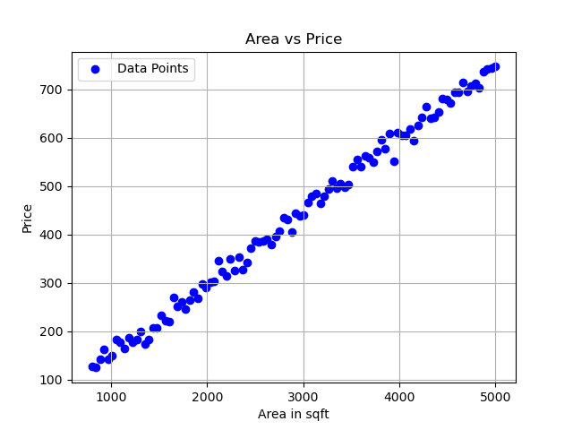

# Understanding the Simple Linear Regression

## Introduction
This project demonstrates the implementation of simple linear regression from scratch, showcasing mathematical insights and visualization. Using a dataset of house areas (in square feet) and their corresponding prices, we:

1. Visualize the original dataset.
2. Scale the data using Min-Max scaling.
3. Use the normal equation to calculate weights and biases for linear regression.
4. Visualize the best-fit line.

---

## Dataset and Visualization
We start with a sample dataset containing house areas and prices. The relationship between these variables is visualized below:



The blue dots represent data points, with house area (in square feet) on the x-axis and price on the y-axis.

---

## Scaling the Data
To improve numerical stability and ensure the algorithm performs optimally, we scale the dataset using Min-Max scaling. The scaled data fits within a range of [0, 1] using the formula:

```
X_scaled = (X - X_min) / (X_max - X_min)
```

The scaled dataset is visualized below:


---

## Mathematical Approach: Normal Equation
Linear regression computes the best-fit line by minimizing the error between predicted and actual values. The weights \(w\) and bias \(b\) are computed using the **normal equation**:

```
w = (X^T * X)^(-1) * X^T * y
```

Where:
- `X`: Matrix of input features (including a column of ones for the bias term).
- `y`: Vector of target values.

After training, we obtain the best-fit line parameters (weights and bias). Predictions are calculated as:

```
y_pred = X * w + b
```

---

## Visualizing the Best-Fit Line
Using the calculated weights and bias, we plot the best-fit line over the scaled data:


The red line represents the best-fit line, indicating the relationship between scaled house area and price as determined by our linear regression model.

---

## Conclusion
This project demonstrates the mathematical and programming aspects of implementing simple linear regression. By scaling data and using the normal equation, we accurately determined the best-fit line for the given dataset.
